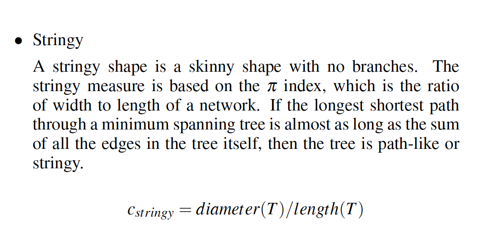
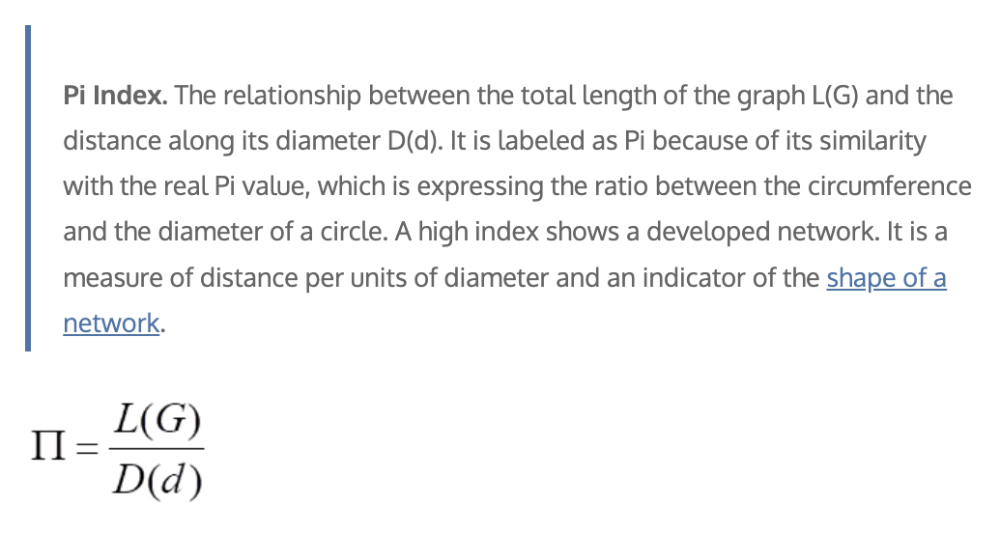

While exploring and doing simulations for scale analysis, especially while exploring the 95th percentile of noise for the `stringy05` index, I came across cases where the index went beyond 1. The exceedance was small, for example around 1.005, but it was still larger than 1. Since scagnostic indices are defined to be between 0 and 1, this made me suspicious about whether the `stringy05` definition had been implemented correctly.

In this blog post, I discuss the `stringy05` index in the `cassowaryr` package, which is used for shape analysis and for capturing stringy-like patterns in two-dimensional data. I explain how I started debugging this index, how I corrected the definition, and how I tested whether the modified version stays within the expected range and behaves properly after the modification.

## Review of the `stringy05` Definition

In this section, I investigate an issue I observed in the current `stringy05` implementation in `cassowaryr`, where values occasionally exceed 1, for example 1.005, for highly string-like shapes. Since this measure should be bounded above by 1, I examine the definition more closely to identify and fix the source of the discrepancy.

The current implementation of the `stringy05` measure is:

```r
diameter <- igraph::get_diameter(x)
length(diameter) / (length(x) - 1)
```

This aims to compute:

> the length of the longest shortest path through the MST divided by the total length of the MST.

However, both the numerator and denominator in the current implementation are problematic.



## Step 1: Example Graph

```{r}
g <- igraph::make_ring(5)

plot(
  g,
  vertex.size = 30,
  vertex.label = 1:5,
  vertex.color = "lightblue",
  edge.width = 4
)
```

## Step 2: Issue with `length(diameter)`

```r
diameter <- igraph::get_diameter(g)
diameter
length(diameter)
```

```{r}
diameter <- igraph::get_diameter(g)
diameter
length(diameter)
```


### Problem

`igraph::get_diameter()` returns a sequence of vertices, not a numeric distance. Therefore, `length(diameter)` counts the number of vertices on the diameter path. It does not return the length of the path in terms of edge weights.

This is important because in the scagnostics setting, the MST edges are weighted by Euclidean distances. Therefore, the numerator should be the weighted length of the longest shortest path through the MST, not the number of vertices on that path.

### Correct approach

A more appropriate approach is to use:

```r
igraph::diameter(g)
```

This returns the length of the **longest shortest path**. When the graph has edge weights, the weighted diameter should be used.


## Step 3: Issue with `length(x) - 1`

```r
length(x) - 1
```

### Problem

* `length(x)` for an igraph object does **not represent total edge length**.
* Even if interpreted as number of vertices, `n - 1` gives only the **number of edges**, not their **lengths**.

This ignores the fact that in scagnostics:

* MST edges are **weighted (Euclidean distances)**
* Total MST length is the **sum of those weights**


## Updated Function

The correct implementation of `stringy05` should follow:

> **(length of longest shortest path) / (total MST edge length)**


```r
w <- igraph::E(x)$weight
total_length <- sum(w)

diameter_length <- igraph::diameter(x)

diameter_length / total_length
```


## Numerical Comparison Before and After the Modification


```{r}

sc_stringy05_old <- function(x, y) {
  sc <- cassowaryr::scree(x, y)
  mst <- cassowaryr:::gen_mst(sc$del, sc$weights)

  diameter <- igraph::get_diameter(mst)

  length(diameter) / (length(mst) - 1)
}

sc_stringy05_modified <- function(x, y) {
  sc <- cassowaryr::scree(x, y)
  mst <- cassowaryr:::gen_mst(sc$del, sc$weights)

  d <- igraph::diameter(
    mst,
    weights = igraph::E(mst)$weight
  )

  L <- sum(igraph::E(mst)$weight)

  d / L
}

data <- spinebil::data_gen(type = "polynomial", degree = 2)

# Cassowaryr version before modification
old_value <- sc_stringy05_old(data[, 1], data[, 2])

# Modified version
new_value <- sc_stringy05_modified(data[, 1], data[, 2])

c(
  old = old_value,
  modified = new_value
)
```

The old implementation can occasionally produce values above 1 because the numerator and denominator are not measuring the same type of quantity. The numerator is based on the number of vertices on the diameter path, while the denominator is not the total weighted MST length.

After modification, both the numerator and denominator are based on MST edge weights. This makes the ratio interpretable and keeps it consistent with the intended definition.

### Pi Index and the Stringy Measure

In network analysis, the Pi index is commonly defined as the ratio between the total length of a network and the distance of the network diameter.



where $L(G)$ is the total length of the graph and $D(d)$ is the distance of the graph diameter.

The `stringy05` measure is closely related to this idea, but it uses the inverse ratio. In the `stringy05` definition, the diameter means the distance of the longest shortest path through the MST. It is the sum of the edge weights along the longest path in the MST.

This ratio should always be less than or equal to 1 because the diameter path is part of the MST, and the total MST length includes all edges in the MST. Therefore, the longest path through the tree cannot have a larger total length than the whole tree.

## Checking Whether My Code Uses Weighted Diameter

My modified stringy function was:

```r
sc_stringy05_modified <- function(x, y) {
  sc <- cassowaryr::scree(x, y)
  mst <- cassowaryr:::gen_mst(sc$del, sc$weights)

  d <- igraph::diameter(mst)

  L <- sum(igraph::E(mst)$weight)

  d / L
}
```

To check whether `igraph::diameter(mst)` gives the weighted diameter, I compared two versions:

1. `diameter(mst)`, where I do not explicitly pass weights.
2. `diameter(mst, weights = E(mst)$weight)`, where I explicitly pass the MST edge weights.

```r
all.equal(d_default, d_weighted)
```

```{r}
x <- c(0, 1, 2, 3, 4, 2)
y <- c(0, 0.1, -0.1, 0.05, 0, 1)

sc <- cassowaryr::scree(x, y)
mst <- cassowaryr:::gen_mst(sc$del, sc$weights)

d_default <- igraph::diameter(mst)

d_weighted <- igraph::diameter(
  mst,
  weights = igraph::E(mst)$weight
)

all.equal(d_default, d_weighted)
```

Since the two values are equal, this confirms that `diameter(mst)` is already using the MST edge weights by default in this case.


```r
all.equal(stringy_default, stringy_weighted)
```

```{r}
L <- sum(igraph::E(mst)$weight)

stringy_default <- d_default / L
stringy_weighted <- d_weighted / L

all.equal(stringy_default, stringy_weighted)
```

Because these are also equal, the modified stringy function is consistent. The numerator uses the weighted diameter of the MST, and the denominator uses the total MST length, calculated by summing the MST edge weights.


---

## Testing the Modified `stringy05` Index

After correcting the definition, the next step is to test whether the modified index behaves as expected. I want to check three main properties:

1. The modified index should not go beyond 1.
2. It should produce values close to 1 for clearly stringy patterns.
3. It should behave sensibly when small Gaussian noise is added to perfect or near-perfect stringy patterns.

To test this, I use polynomial data generated from the `spinebil` package. Polynomial patterns are useful here because they create smooth, structured relationships. Some pairwise combinations of polynomial degrees produce strong string-like shapes, which makes them good test cases for the modified stringy index.

### Generating Polynomial Data

First, I generate polynomial data with degree 5:

```{r}

library(spinebil)
library(tidyverse)

set.seed(545)

poly_data <- spinebil::data_gen(
  type = "polynomial",
  degree = 5
)

poly_data <- as.data.frame(poly_data)
names(poly_data) <- paste0("deg", seq_len(ncol(poly_data)))
```

This gives five polynomial variables. I then examine all non-equal pairwise combinations, such as degree 1 versus degree 2, degree 1 versus degree 3, and so on.

```{r}
pair_data <- combn(names(poly_data), 2, simplify = FALSE) |>
  purrr::map_dfr(function(pair) {
    tibble(
      var_pair = paste(pair, collapse = " vs "),
      x = poly_data[[pair[1]]],
      y = poly_data[[pair[2]]]
    )
  })

ggplot(pair_data, aes(x = x, y = y)) +
  geom_point(alpha = 0.6, size = 0.8) +
  facet_wrap(~ var_pair, nrow = 2) +
  labs(
    title = "Pairwise polynomial patterns",
    x = NULL,
    y = NULL
  ) +
  theme(aspect.ratio = 1,
        axis.text = element_blank(),
        axis.ticks = element_blank())
```

These plots show the different two-dimensional shapes generated by the polynomial basis. Some combinations form very clear string-like structures, while others have more curved or folded shapes.

I then use `spinebil::ppi_scale()` to evaluate the modified `stringy05` index over 100 repetitions.

```r
res <- spinebil::ppi_scale(
  spinebil::data_gen("polynomial", degree = 5),
  sc_stringy05_modified,
  n_sim = 100
)
```

This gives repeated values of the modified stringy index across different variable pairs and simulation settings.

```{r}
res <- spinebil::ppi_scale(poly_data,
  sc_stringy05_modified,
  n_sim = 100
)
head(res)

```

### Checking That the Modified Index Does Not Exceed 1

The most important test is whether the modified index stays inside the expected interval $[0, 1]$. Because very small floating-point errors can sometimes occur in numerical calculations, I check the bound using a tiny tolerance:

```r
tol <- 1e-12
res |>
  filter(index > 1 + tol) |>
  arrange(desc(index))
```

```{r}
tol <- 1e-12
res |>
  filter(index > 1 + tol) |>
  arrange(desc(index))
```

```r
bounds_check <- res |>
  summarise(
    min_index = min(index, na.rm = TRUE),
    max_index = max(index, na.rm = TRUE),
    any_below_0 = any(index < 0, na.rm = TRUE),
    any_above_1 = any(index > 1 + tol, na.rm = TRUE),
    n_below_0 = sum(index < 0, na.rm = TRUE),
    n_above_1 = sum(index > 1 + tol, na.rm = TRUE)
  )

bounds_check
```

```{r}
bounds_check <- res |>
  summarise(
    min_index = min(index, na.rm = TRUE),
    max_index = max(index, na.rm = TRUE),
    any_below_0 = any(index < 0, na.rm = TRUE),
    any_above_1 = any(index > 1 + tol, na.rm = TRUE),
    n_below_0 = sum(index < 0, na.rm = TRUE),
    n_above_1 = sum(index > 1 + tol, na.rm = TRUE)
  )

bounds_check
```


This confirms that the modified implementation respects the theoretical upper bound.


### Visualising the Repeated Index Values

```{r}
ggplot(res, aes(x = var_pair, y = index)) +
  geom_boxplot(outlier.alpha = 0.5) +
  coord_flip() +
  theme_minimal(base_size = 12) +
  labs(
    title = "Modified stringy05 index on polynomial data",
    subtitle = "100 repetitions",
    x = "Polynomial variable pair",
    y = "Modified stringy05 index"
  )
```

This plot is useful because it shows not only the average behaviour of the index, but also the spread across repeated simulations.


> For strongly stringy polynomial patterns, the modified index frequently gives values close to 1, not exceeding 1.


## Conclusion

The original implementation of `stringy05` occasionally produced values slightly larger than 1 because the numerator and denominator were not both based on weighted MST lengths. The numerator used the number of vertices returned by `get_diameter()`, while the denominator did not represent the total weighted length of the MST.

The corrected implementation computes:

$$
\text{stringy05} =
\frac{\text{weighted MST diameter}}
{\text{total weighted MST length}}.
$$

This version is consistent with the intended definition. In the simulations, the modified index stays within the expected $[0, 1]$ range, gives values close to 1 for strong string-like polynomial patterns. This gives empirical support that the corrected `stringy05` index is properly scaled and better aligned with the scagnostics definition.


## References

1. Dr. Cesar Ducruet and Dr. Jean-Paul Rodrigue, *Graph Theory: Measures and Indices*.
2. L. Wilkinson, A. Anand and R. Grossman, "Graph-theoretic scagnostics," IEEE Symposium on Information Visualization, 2005. INFOVIS 2005., Minneapolis, MN, USA, 2005, pp. 157-164, doi: 10.1109/INFVIS.2005.1532142.
3. Mason H, Lee S, Laa U, Cook D (2022). cassowaryr: Compute Scagnostics on Pairs of Numeric Variables in a Data Set. R package version 2.0.0
