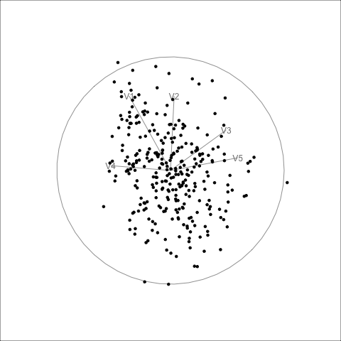

## Starting point

As part of my Google Summer of Code project with `tourr`, I started by exploring how scagnostic measures can be used as projection pursuit indexes. The goal of this work is to add new indexes to the `tourr` package so that guided tours can search for interesting low-dimensional views of high-dimensional data.

In this post, I focus on adding a new index called `stringy05`. This index is designed to detect string-like, elongated, and wave-like patterns in two-dimensional projections. These kinds of patterns are especially interesting because they may be hidden in high-dimensional data and may not be visible in standard views such as pairs of original variables or principal components.

The main idea is to turn `stringy05` into a projection pursuit index. In a guided tour, the data are repeatedly projected from high dimensions down to two dimensions. At each projected view, the index function gives a score. The guided tour then tries to move toward projections with higher scores. By using `stringy05` as the index, the guided tour can search for projections where the data form a stringy or wave-like shape.

## Adding `stringy05` as a projection pursuit index


```r
stringy05 <- function() {
  function(mat) {
    cassowaryr::sc_stringy05(mat[, 1], mat[, 2])
  }
}
```


With this structure, I can use the index inside a guided tour:

```r
guided_tour(stringy05())
```


## Why rescaling is needed

While exploring the behaviour of the `stringy05` index, I found that it does not necessarily return values close to zero for bivariate Gaussian data. This is important because, in high-dimensional data, many random projections can look approximately Gaussian. If the raw index gives these noise-like projections nonzero scores, the guided tour may spend time moving toward noisy views instead of real stringy patterns.

To address this, I estimated the 95th percentile of the noise distribution of `stringy05` under bivariate Gaussian data. This gives a sample-size-dependent lower bound for values that can be expected from noise alone. I then used this threshold to rescale the index.

The rescaling function is:

```r
rescale_stringy05 <- function(z, n) {
  lb <- 0.05 + 3.86 / sqrt(n)
  pmax(0, (z - lb) / (1 - lb))
}
```

Here, `z` is the raw `stringy05` value and `n` is the sample size. Values below the estimated noise threshold are pushed to zero. Values above the threshold are rescaled so that the index focuses more on projections with stronger evidence of real stringy structure.

The updated index includes an option to use this rescaling:

```r
stringy05 <- function(rescale = FALSE) {
  function(mat) {
    z <- cassowaryr::sc_stringy05(mat[, 1], mat[, 2])

    if (rescale) {
      z <- rescale_stringy05(z, nrow(mat))
    }

    z
  }
}
```

Now I can use either the raw index:

```r
guided_tour(stringy05())
```

or the rescaled version:

```r
guided_tour(stringy05(rescale = TRUE))
```

The rescaled version is useful because it reduces the influence of noise-like Gaussian projections. This should help the optimization focus on projections that contain stronger and more meaningful stringy patterns.


## Next step: generating test data

After adding the index and the rescaling option, the next step is to test how well it works. To do this, I will generate sample high-dimensional datasets where the true structure is known.

I will start with datasets that contain two signal variables forming stringy patterns, such as linear, quadratic, and wave-like shapes. Then I will add several noise variables to make the problem high-dimensional. This setup will allow me to check whether the guided tour using `stringy05` can recover the hidden stringy projection.


 I generated a five-dimensional dataset. Three of the variables are pure noise, and two variables contain the true signal. The signal variables form a perfect polynomial pattern: one variable is a degree 1 polynomial and the other is a degree 2 polynomial.

I placed the signal variables in positions 3 and 5, so the structure is hidden between noise variables:

```text
V1 = noise
V2 = noise
V3 = polynomial degree 1
V4 = noise
V5 = polynomial degree 2
```

The true interesting view is therefore the projection onto variables `V3` and `V5`.

```{r}
library(tourr)
library(tidyverse)

set.seed(1051)

n <- 300

t <- seq(-1, 1, length.out = n)

poly_signal <- poly(t, degree = 2, raw = TRUE)

poly_data <- data.frame(
  V1 = rnorm(n),
  V2 = rnorm(n),
  V3 = poly_signal[, 1],
  V4 = rnorm(n),
  V5 = poly_signal[, 2]
)

```

Before using the guided tour, I first plotted the two signal variables directly. This is the target structure that I want the guided tour to find.

```{r}
ggplot(poly_data, aes(x = V3, y = V5)) +
         geom_point() +
  theme(aspect.ratio = 1,
        axis.ticks = element_blank(),
        axis.text = element_blank())
```

This plot shows the perfect polynomial curve. However, in the full dataset this structure is hidden inside five dimensions, together with three noise variables.

## Running the guided tour with `stringy05`

For the first test, I used the raw version of the index. I wanted to see whether the index can find this clean polynomial structure before adding the rescaling step.

The guided tour was run in a separate R script because rendering GIFs can take some time. The main code was:

```r
idx_stringy_raw <- stringy05()

poly_history_raw <- save_history(
  poly_data,
  guided_tour(idx_stringy_raw),
  sphere = FALSE
)

render_gif(
  poly_data,
  planned_tour(poly_history_raw),
  display_xy(),
  gif_file = "gifs/stringy05_raw_polynomial_guided_tour.gif",
  sphere = FALSE
)
```


## Raw `stringy05`


## Rescaled `stringy05`




