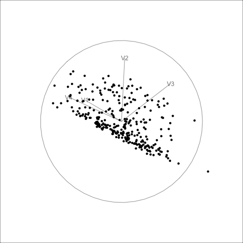
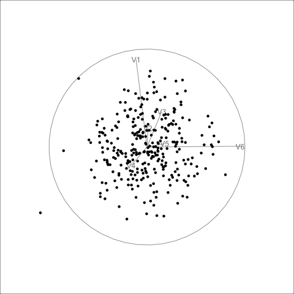
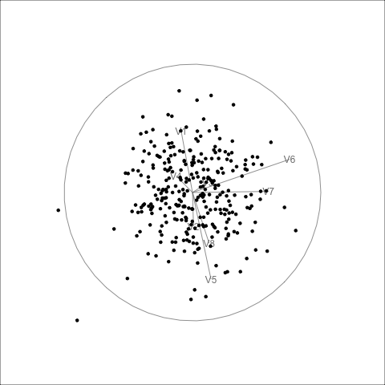

## Goal

In the previous post, I explored whether `stringy05` behaves like a suitable projection pursuit index. I checked properties such as rotation invariance, trace behaviour, smoothness, and squintability.

In this post, I move to the next question:

**Can different `tourr` search methods actually find the true hidden projection?**

The data are generated so that only variables 2 and 3 contain the polynomial structure. The remaining variables are Gaussian noise. I repeat this for 4, 6, and 8 dimensions.


Here, I use the rescaled `stringy05` index as the objective function.


```{r}
# Load packages
library(tourr)
library(cassowaryr)
library(dplyr)
library(tidyr)
library(purrr)
library(ggplot2)
library(tibble)
```


```{r}

# Define the index
rescale_stringy05 <- function(z, n) {
  lb <- 0.05 + 3.86 / sqrt(n)
  pmax(0, (z - lb) / (1 - lb))
}

stringy05_raw <- function(rescale = FALSE) {
  function(mat) {
    z <- cassowaryr::sc_stringy05(mat[, 1], mat[, 2])

    if (rescale) {
      z <- rescale_stringy05(z, nrow(mat))
    }

    z
  }
}

stringy05_index <- stringy05_raw(rescale = TRUE)

# Generate polynomial data
make_poly_data <- function(n = 300, p = 4, degree = 2, seed = 1050,
                           signal_noise_sd = 0.03) {
  set.seed(seed)

  t <- seq(-1, 1, length.out = n)
  signal <- poly(t, degree = degree, raw = TRUE)

  x <- matrix(rnorm(n * p), nrow = n, ncol = p)

  x[, 2] <- signal[, 1] + rnorm(n, sd = signal_noise_sd)
  x[, 3] <- signal[, 2] + rnorm(n, sd = signal_noise_sd)

  colnames(x) <- paste0("V", seq_len(p))

  as.data.frame(x)
}

dat4 <-  make_poly_data(p = 4, seed = 1050)
dat6 <-  make_poly_data(p = 6, seed = 1050)
dat8 <-  make_poly_data(p = 8, seed = 1050)

```

The true projection is always the plane spanned by variables 2 and 3.

```{r}
true_basis <- function(p) {
  diag(p)[, c(2, 3)]
}
```

## Helper functions

I compare each optimized basis with the true basis using projection distance:

$$
d(A, B) =
|AA^T - BB^T|_F.
$$

Smaller distance means the optimizer found a projection closer to the true polynomial plane.

```{r}
projection_distance <- function(A, B) {
  norm(A %*% t(A) - B %*% t(B), type = "F")
}

index_at_basis <- function(data, basis, index_f = stringy05_index) {
  index_f(as.matrix(data) %*% basis)
}
```


## First optimizer test: geodesic and better random

To keep the first experiment simple, I start with two search methods:

- `search_geodesic`
- `search_better_random`

I run each method once for 4D, 6D, and 8D data, save the basis history, compute the index value along the path, and then replay the history as a GIF using `planned_tour()`.


## 4D data

### `search_geodesic`

```{r, eval=FALSE}
set.seed(1050)

hist_p4_geodesic <- save_history(
  dat4,
  guided_tour(
    index_f = stringy05_index,
    search_f = search_geodesic
  )
)

saveRDS(hist_p4_geodesic, "blog/tourr_stringy/hist_p4_geodesic.rds")

render_gif(
  dat4,
  planned_tour(hist_p4_geodesic),
  display_xy(),
  gif_file = "blog/tourr_stringy/p4_geodesic.gif",
  sphere = FALSE
)
```

```{r}

```

## 6D data

### `search_geodesic`

```{r, eval=FALSE}
set.seed(1050)

p6_history_geodesic <- save_history(
  dat6,
  guided_tour(
    index_f = stringy05_index,
    search_f = search_geodesic
  ),
  sphere = FALSE
)

saveRDS(p6_history_geodesic, "p6_history_geodesic.rds")

render_gif(
  dat6,
  planned_tour(p6_history_geodesic),
  display_xy(),
  gif_file = "p6_geodesic.gif",
  sphere = FALSE
)
```

```{r}

```

## 8D data

### `search_geodesic`

```{r, eval=FALSE}
set.seed(1050)

p8_history_geodesic <- save_history(
  dat8,
  guided_tour(
    index_f = stringy05_index,
    search_f = search_geodesic
  ),
  sphere = FALSE
)

saveRDS(p8_history_geodesic, "p8_history_geodesic.rds")

render_gif(
  dat8,
  planned_tour(p8_history_geodesic),
  display_xy(),
  gif_file = "p8_geodesic.gif",
  sphere = FALSE
)
```
```{r}

```

## 4D data

### `search_better_random`

```{r, eval=FALSE}
set.seed(1050)

p4_history_better_random <- save_history(
  dat4,
  guided_tour(
    index_f = stringy05_index,
    search_f = search_better_random
  ),
  sphere = FALSE
)

saveRDS(
  p6_history_better_random,
  "p4_history_better_random.rds"
)

render_gif(
  dat4,
  planned_tour(p4_history_better_random),
  display_xy(),
  gif_file = "p4_better_random.gif",
  sphere = FALSE
)
```


```{r} 

```


## 6D data

### `search_better_random`

```{r, eval=FALSE}
set.seed(1050)

p6_history_better_random <- save_history(
  dat6,
  guided_tour(
    index_f = stringy05_index,
    search_f = search_better_random
  ),
  sphere = FALSE
)

saveRDS(
  p6_history_better_random,
  "p6_history_better_random.rds"
)

render_gif(
  dat6,
  planned_tour(p6_history_better_random),
  display_xy(),
  gif_file = "p6_better_random.gif",
  sphere = FALSE
)
```

```{r} 

```

## 8D data

### `search_better_random`

```{r, eval=FALSE} 
set.seed(1050)

p8_history_better_random <- save_history(
  dat8,
  guided_tour(
    index_f = stringy05_index,
    search_f = search_better_random
  ),
  sphere = FALSE
)

saveRDS(
  p8_history_better_random,
  "p8_history_better_random.rds"
)

render_gif(
  dat8,
  planned_tour(p8_history_better_random),
  display_xy(),
  gif_file = "p8_better_random.gif",
  sphere = FALSE
)
```


```{r}

```

## Jellyfish search

Unlike `search_geodesic()` and `search_better_random()`, the Jellyfish optimizer does not follow a single optimisation path. It keeps several candidate bases at each iteration. Therefore, `save_history()` is not suitable here.

Instead, I use `animate_xy()` to run the guided tour and store the returned object. I then inspect the returned object, extract one path of bases, and replay that path using `planned_tour()`.

### 4D Jellyfish search

```{r, eval=FALSE}
set.seed(1050)

p4_jellyfish_res <- animate_xy(
  dat4,
  guided_tour(
    index_f = stringy05_index,
    search_f = search_jellyfish
  ),
  sphere = FALSE
)

saveRDS(p4_jellyfish_res, "p4_jellyfish_res.rds")

# Extract one jellyfish path
p4_jelly_1 <- p4_jellyfish_res |>
  dplyr::filter(id == 1)

p4_jelly_1_bases <- p4_jelly_1$basis

render_gif(
  dat4,
  planned_tour(p4_jelly_1_bases),
  display_xy(),
  gif_file = "p4_jellyfish_jelly1.gif",
  sphere = FALSE
)
```


```{r}
knitr::include_graphics("p4_jellyfish_jelly1.gif")

p4_jellyfish_res <- readRDS("p4_jellyfish_res.rds")

p4_jelly_1 <- p4_jellyfish_res |>
  dplyr::filter(id == 1)
p4_jelly_1

p4_jelly_750 <- p4_jellyfish_res |>
  dplyr::filter(id == 750)

p4_jelly_750

p4_jellyfish_res
```